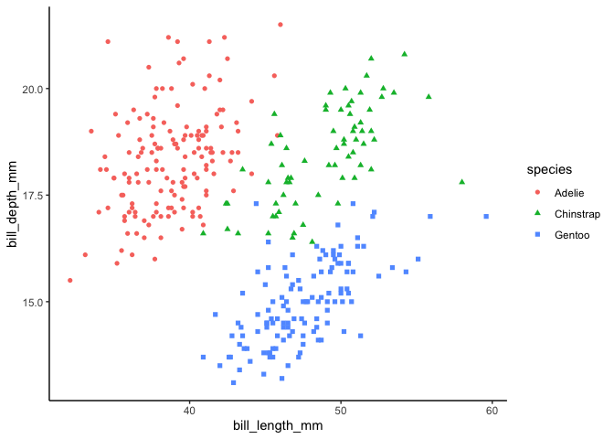

<my-callout> This article has been updated to keep up with dplyr 1.1.
</my-callout>

This post uses the penguins dataset modified by [Allison
Horst](https://github.com/allisonhorst/penguins) in all the code
examples (as an alternative to `iris`).

``` r
library(dplyr)
# !collapse(1:8)
#> 
#> Attaching package: 'dplyr'
#> The following objects are masked from 'package:stats':
#> 
#>     filter, lag
#> The following objects are masked from 'package:base':
#> 
#>     intersect, setdiff, setequal, union
library(ggplot2)

packageVersion("dplyr")
#> [1] '1.1.2'
```

``` r
penguins <- palmerpenguins::penguins
penguins
# !collapse(1:15) collapsed
#> # A tibble: 344 × 8
#>    species island    bill_length_mm bill_depth_mm flipper_length_mm body_mass_g
#>    <fct>   <fct>              <dbl>         <dbl>             <int>       <int>
#>  1 Adelie  Torgersen           39.1          18.7               181        3750
#>  2 Adelie  Torgersen           39.5          17.4               186        3800
#>  3 Adelie  Torgersen           40.3          18                 195        3250
#>  4 Adelie  Torgersen           NA            NA                  NA          NA
#>  5 Adelie  Torgersen           36.7          19.3               193        3450
#>  6 Adelie  Torgersen           39.3          20.6               190        3650
#>  7 Adelie  Torgersen           38.9          17.8               181        3625
#>  8 Adelie  Torgersen           39.2          19.6               195        4675
#>  9 Adelie  Torgersen           34.1          18.1               193        3475
#> 10 Adelie  Torgersen           42            20.2               190        4250
#> # ℹ 334 more rows
#> # ℹ 2 more variables: sex <fct>, year <int>
```

``` r
penguins %>%
  ggplot(aes(bill_length_mm, bill_depth_mm, color = species, shape = species)) +
  geom_point()
#> Warning: Removed 2 rows containing missing values or values outside the scale range
#> (`geom_point()`).
#> Warning in vp$just: partial match of 'just' to 'justification'
```



## Column-wise Workflows {#column-wise-workflows}

The new `across()` function supersedes functionalities of `_at`, `_if`,
`_all` variants. The first argument, `.cols`, selects the columns you
want to operate on. It uses tidy selection (like `select()`) so you can
pick variables by position, name, and type. The second argument, `.fns`,
is a function or list of functions to apply to each column. This can
also be a purrr style formula

``` r
penguins_grouped <- penguins %>% group_by(species)

penguins_grouped %>%
  summarize(across(starts_with("bill"), ~ mean(.x, na.rm = TRUE)),
    n = n()
  )
# !collapse(1:6)
#> # A tibble: 3 × 4
#>   species   bill_length_mm bill_depth_mm     n
#>   <fct>              <dbl>         <dbl> <int>
#> 1 Adelie              38.8          18.3   152
#> 2 Chinstrap           48.8          18.4    68
#> 3 Gentoo              47.5          15.0   124
```

For conditional selection (previous `_if` variants), predicate function
should be wrapped in `where`.

``` r
# double all numeric columns
penguins %>%
  mutate(across(where(is.numeric), ~ .x * 2))
# !collapse(1:16) collapsed
#> # A tibble: 344 × 8
#>    species island    bill_length_mm bill_depth_mm flipper_length_mm body_mass_g
#>    <fct>   <fct>              <dbl>         <dbl>             <dbl>       <dbl>
#>  1 Adelie  Torgersen           78.2          37.4               362        7500
#>  2 Adelie  Torgersen           79            34.8               372        7600
#>  3 Adelie  Torgersen           80.6          36                 390        6500
#>  4 Adelie  Torgersen           NA            NA                  NA          NA
#>  5 Adelie  Torgersen           73.4          38.6               386        6900
#>  6 Adelie  Torgersen           78.6          41.2               380        7300
#>  7 Adelie  Torgersen           77.8          35.6               362        7250
#>  8 Adelie  Torgersen           78.4          39.2               390        9350
#>  9 Adelie  Torgersen           68.2          36.2               386        6950
#> 10 Adelie  Torgersen           84            40.4               380        8500
#> # ℹ 334 more rows
#> # ℹ 2 more variables: sex <fct>, year <dbl>

# count unique values of all character columns
penguins %>%
  summarize(across(where(is.character), ~ length(unique(.x))))
#> # A tibble: 1 × 0
```

Apply multiple functions using list and use the `.names` argument to
control column names.

``` r
penguins_grouped %>%
  summarize(across(matches("mm"),
    list(
      min = ~ min(.x, na.rm = TRUE),
      max = ~ max(.x, na.rm = TRUE)
    ),
    .names = "{fn}_{col}"
  ))
# !collapse(1:8)
#> # A tibble: 3 × 7
#>   species   min_bill_length_mm max_bill_length_mm min_bill_depth_mm
#>   <fct>                  <dbl>              <dbl>             <dbl>
#> 1 Adelie                  32.1               46                15.5
#> 2 Chinstrap               40.9               58                16.4
#> 3 Gentoo                  40.9               59.6              13.1
#> # ℹ 3 more variables: max_bill_depth_mm <dbl>, min_flipper_length_mm <int>,
#> #   max_flipper_length_mm <int>
```

## Row-wise Workflows {#row-wise-workflows}

Row-wise operations require a special type of grouping where each group
consists of a single row. You create this with `rowwise()`.

``` r
df <- tibble(
  student_id = 1:4,
  test1 = 10:13,
  test2 = 20:23,
  test3 = 30:33,
  test4 = 40:43
)
df %>% rowwise()
# !collapse(1:8)
#> # A tibble: 4 × 5
#> # Rowwise: 
#>   student_id test1 test2 test3 test4
#>        <int> <int> <int> <int> <int>
#> 1          1    10    20    30    40
#> 2          2    11    21    31    41
#> 3          3    12    22    32    42
#> 4          4    13    23    33    43
```

`rowwise` doesn’t need any additional arguments unless you have
variables that identify the rows, like `student_id` here. This can be
helpful when you want to keep a row identifier.

Like `group_by`, `rowwise` doesn’t really do anything itself; it just
changes how the other verbs work.

``` r
df %>% mutate(avg = mean(c(test1, test2, test3, test4)))
# !collapse(1:8)
#> # A tibble: 4 × 6
#>   student_id test1 test2 test3 test4   avg
#>        <int> <int> <int> <int> <int> <dbl>
#> 1          1    10    20    30    40  26.5
#> 2          2    11    21    31    41  26.5
#> 3          3    12    22    32    42  26.5
#> 4          4    13    23    33    43  26.5

df %>%
  rowwise() %>%
  mutate(avg = mean(c(test1, test2, test3, test4)))
# !collapse(1:8)
#> # A tibble: 4 × 6
#> # Rowwise: 
#>   student_id test1 test2 test3 test4   avg
#>        <int> <int> <int> <int> <int> <dbl>
#> 1          1    10    20    30    40    25
#> 2          2    11    21    31    41    26
#> 3          3    12    22    32    42    27
#> 4          4    13    23    33    43    28
```

`rowwise` takes each row, feeds it into a function, and return a tibble
with the same number of rows. This essentially parallelize a function
over the rows in the dataframe. In this case, the `mean()` function is
vectorized. But, if a function is already vectorized, then `rowwise` is
not needed.

``` r
df %>% mutate(s = test1 + test2 + test3)
# !collapse(1:8)
#> # A tibble: 4 × 6
#>   student_id test1 test2 test3 test4     s
#>        <int> <int> <int> <int> <int> <int>
#> 1          1    10    20    30    40    60
#> 2          2    11    21    31    41    63
#> 3          3    12    22    32    42    66
#> 4          4    13    23    33    43    69

df %>%
  rowwise() %>%
  mutate(s = test1 + test2 + test3)
# !collapse(1:8)
#> # A tibble: 4 × 6
#> # Rowwise: 
#>   student_id test1 test2 test3 test4     s
#>        <int> <int> <int> <int> <int> <int>
#> 1          1    10    20    30    40    60
#> 2          2    11    21    31    41    63
#> 3          3    12    22    32    42    66
#> 4          4    13    23    33    43    69
```

Another family of summary functions have “parallel” extensions where you
can provide multiple variables in the arguments:

``` r
df %>%
  mutate(
    min = pmin(test1, test2, test3, test4),
    max = pmax(test1, test2, test3, test4),
    string = paste(test1, test2, test3, test4, sep = "-")
  )
# !collapse(1:7)
#> # A tibble: 4 × 8
#>   student_id test1 test2 test3 test4   min   max string     
#>        <int> <int> <int> <int> <int> <int> <int> <chr>      
#> 1          1    10    20    30    40    10    40 10-20-30-40
#> 2          2    11    21    31    41    11    41 11-21-31-41
#> 3          3    12    22    32    42    12    42 12-22-32-42
#> 4          4    13    23    33    43    13    43 13-23-33-43
```

Where these functions exist, they’ll usually be faster than `rowwise`.
The advantage of `rowwise` is that it works with any function, not just
those that are already vectorized.

However, an advantage of `rowwise` even there is other ways is that it’s
paired with `c_across()`, which works like `c()` but uses the same
tidyselect syntax as `across()`. That makes it easy to operate on
multiple variables:

``` r
df %>%
  rowwise() %>%
  mutate(
    min = min(c_across(starts_with("test"))),
    max = max(c_across(starts_with("test")))
  )
# !collapse(1:8)
#> # A tibble: 4 × 7
#> # Rowwise: 
#>   student_id test1 test2 test3 test4   min   max
#>        <int> <int> <int> <int> <int> <int> <int>
#> 1          1    10    20    30    40    10    40
#> 2          2    11    21    31    41    11    41
#> 3          3    12    22    32    42    12    42
#> 4          4    13    23    33    43    13    43
```

Plus, a rowwise df will naturally contain exactly the same rows after
`summarize()`, the same as `mutate`

``` r
df %>%
  rowwise() %>%
  summarize(across(starts_with("test"), ~ .x, .names = "{col}_same"))
# !collapse(1:7)
#> # A tibble: 4 × 4
#>   test1_same test2_same test3_same test4_same
#>        <int>      <int>      <int>      <int>
#> 1         10         20         30         40
#> 2         11         21         31         41
#> 3         12         22         32         42
#> 4         13         23         33         43
```

### List Columns {#list-columns}

Because lists can contain anything, you can use list-columns to keep
related objects together, regardless of what type of thing they are.
List-columns give you a convenient storage mechanism and `rowwise` gives
you a convenient computation mechanism.

``` r
df <- tibble(
  x = list(1, 2:3, 4:6),
  y = list(TRUE, 1, "a"),
  z = list(sum, mean, sd)
)
df
# !collapse(1:6)
#> # A tibble: 3 × 3
#>   x         y         z     
#>   <list>    <list>    <list>
#> 1 <dbl [1]> <lgl [1]> <fn>  
#> 2 <int [2]> <dbl [1]> <fn>  
#> 3 <int [3]> <chr [1]> <fn>
```

``` r
df %>%
  rowwise() %>%
  summarize(
    x_length = length(x),
    y_type = typeof(y),
    z_call = z(1:5)
  )
# !collapse(1:6)
#> # A tibble: 3 × 3
#>   x_length y_type    z_call
#>      <int> <chr>      <dbl>
#> 1        1 logical    15   
#> 2        2 double      3   
#> 3        3 character   1.58
```

### Simulation {#simulation}

The basic idea of using `rowwise` to perform simulation is to store all
your simulation parameters in a data frame, similar to `purrr::pmap`.

``` r
df <- tribble(
  ~id, ~n, ~min, ~max,
  1, 3, 0, 1,
  2, 2, 10, 100,
  3, 2, 100, 1000,
)
```

Then you can either generate a list-column containing the simulated
values with `mutate`:

``` r
df %>%
  rowwise() %>%
  mutate(sim = list(runif(n, min, max)))
# !collapse(1:7)
#> # A tibble: 3 × 5
#> # Rowwise: 
#>      id     n   min   max sim      
#>   <dbl> <dbl> <dbl> <dbl> <list>   
#> 1     1     3     0     1 <dbl [3]>
#> 2     2     2    10   100 <dbl [2]>
#> 3     3     2   100  1000 <dbl [2]>
```

Or taking advantage of `summarize`’s new features to return multiple
rows per group

``` r
df %>%
  rowwise(everything()) %>%
  summarize(sim = runif(n, min, max))
# !collapse(1:18) collapsed
#> Warning: Returning more (or less) than 1 row per `summarise()` group was deprecated in
#> dplyr 1.1.0.
#> ℹ Please use `reframe()` instead.
#> ℹ When switching from `summarise()` to `reframe()`, remember that `reframe()`
#>   always returns an ungrouped data frame and adjust accordingly.
#> `summarise()` has grouped output by 'id', 'n', 'min', 'max'. You can override
#> using the `.groups` argument.
#> # A tibble: 7 × 5
#> # Groups:   id, n, min, max [3]
#>      id     n   min   max      sim
#>   <dbl> <dbl> <dbl> <dbl>    <dbl>
#> 1     1     3     0     1   0.448 
#> 2     1     3     0     1   0.0171
#> 3     1     3     0     1   0.388 
#> 4     2     2    10   100  57.9   
#> 5     2     2    10   100  52.9   
#> 6     3     2   100  1000 837.    
#> 7     3     2   100  1000 272.
```

<my-callout>

In dplyr 1.1, you should use `reframe()` instead of `summarize()` to
return multiple rows.

``` r
df |>
  rowwise(everything()) |>
  reframe(sim = runif(n, min, max))
```

</my-callout>

Without `rowwise`, you would need to use `purrr::pmap` to perform the
simulation.

``` r
df %>%
  mutate(sim = purrr::pmap(., ~ runif(..2, ..3, ..4)))
# !collapse(1:6)
#> # A tibble: 3 × 5
#>      id     n   min   max sim      
#>   <dbl> <dbl> <dbl> <dbl> <list>   
#> 1     1     3     0     1 <dbl [3]>
#> 2     2     2    10   100 <dbl [2]>
#> 3     3     2   100  1000 <dbl [2]>
```

## Group-wise Models {#group-wise-models}

The new `nest_by()` function works similarly to `group_nest()`

``` r
by_species <- penguins %>% nest_by(species)
by_species
# !collapse(1:7)
#> # A tibble: 3 × 2
#> # Rowwise:  species
#>   species                 data
#>   <fct>     <list<tibble[,7]>>
#> 1 Adelie             [152 × 7]
#> 2 Chinstrap           [68 × 7]
#> 3 Gentoo             [124 × 7]
```

Now we can use `mutate` to fit a model to each data frame:

``` r
by_species <- by_species %>%
  rowwise(species) %>%
  mutate(model = list(lm(bill_length_mm ~ bill_depth_mm, data = data)))

by_species
# !collapse(1:7)
#> # A tibble: 3 × 3
#> # Rowwise:  species
#>   species                 data model 
#>   <fct>     <list<tibble[,7]>> <list>
#> 1 Adelie             [152 × 7] <lm>  
#> 2 Chinstrap           [68 × 7] <lm>  
#> 3 Gentoo             [124 × 7] <lm>
```

And then extract model summaries or coefficients with `summarize()` and
`broom` functions (note that `by_species` is still a rowwise data
frame):

``` r
by_species %>%
  summarize(broom::glance(model))
# !collapse(1:11) collapsed
#> `summarise()` has grouped output by 'species'. You can override using the
#> `.groups` argument.
#> # A tibble: 3 × 13
#> # Groups:   species [3]
#>   species   r.squared adj.r.squared sigma statistic  p.value    df logLik   AIC
#>   <fct>         <dbl>         <dbl> <dbl>     <dbl>    <dbl> <dbl>  <dbl> <dbl>
#> 1 Adelie        0.153         0.148  2.46      27.0 6.67e- 7     1  -349.  704.
#> 2 Chinstrap     0.427         0.418  2.55      49.2 1.53e- 9     1  -159.  324.
#> 3 Gentoo        0.414         0.409  2.37      85.5 1.02e-15     1  -280.  565.
#> # ℹ 4 more variables: BIC <dbl>, deviance <dbl>, df.residual <int>, nobs <int>

by_species %>%
  summarize(broom::tidy(model))
# !collapse(1:17) collapsed
#> Warning: Returning more (or less) than 1 row per `summarise()` group was deprecated in
#> dplyr 1.1.0.
#> ℹ Please use `reframe()` instead.
#> ℹ When switching from `summarise()` to `reframe()`, remember that `reframe()`
#>   always returns an ungrouped data frame and adjust accordingly.
#> `summarise()` has grouped output by 'species'. You can override using the
#> `.groups` argument.
#> # A tibble: 6 × 6
#> # Groups:   species [3]
#>   species   term          estimate std.error statistic  p.value
#>   <fct>     <chr>            <dbl>     <dbl>     <dbl>    <dbl>
#> 1 Adelie    (Intercept)     23.1       3.03       7.60 3.01e-12
#> 2 Adelie    bill_depth_mm    0.857     0.165      5.19 6.67e- 7
#> 3 Chinstrap (Intercept)     13.4       5.06       2.66 9.92e- 3
#> 4 Chinstrap bill_depth_mm    1.92      0.274      7.01 1.53e- 9
#> 5 Gentoo    (Intercept)     17.2       3.28       5.25 6.60e- 7
#> 6 Gentoo    bill_depth_mm    2.02      0.219      9.24 1.02e-15
```

An alternative approach

``` r
penguins %>%
  group_by(species) %>%
  group_modify(~ broom::tidy(lm(bill_length_mm ~ bill_depth_mm, data = .x)))
# !collapse(1:10)
#> # A tibble: 6 × 6
#> # Groups:   species [3]
#>   species   term          estimate std.error statistic  p.value
#>   <fct>     <chr>            <dbl>     <dbl>     <dbl>    <dbl>
#> 1 Adelie    (Intercept)     23.1       3.03       7.60 3.01e-12
#> 2 Adelie    bill_depth_mm    0.857     0.165      5.19 6.67e- 7
#> 3 Chinstrap (Intercept)     13.4       5.06       2.66 9.92e- 3
#> 4 Chinstrap bill_depth_mm    1.92      0.274      7.01 1.53e- 9
#> 5 Gentoo    (Intercept)     17.2       3.28       5.25 6.60e- 7
#> 6 Gentoo    bill_depth_mm    2.02      0.219      9.24 1.02e-15
```

## New `summarize` Features {#new-summarize-features}

<my-callout>

Use `reframe()` instead of `summarize()` to return multiple rows
starting from dplyr 1.1.

</my-callout>

### Multiple Rows and Columns {#multiple-rows-and-columns}

Two big changes make `summarize()` much more flexible. A single summary
expression can now return:

- A vector of any length, creating multiple rows. (so we can use summary
  that returns multiple values without `list`)

- A data frame, creating multiple columns.

``` r
penguins_grouped %>%
  summarize(
    bill_length_dist = quantile(bill_length_mm,
      c(0.25, 0.5, 0.75),
      na.rm = TRUE
    ),
    q = c(0.25, 0.5, 0.75)
  )
# !collapse(1:20) collapsed
#> Warning: Returning more (or less) than 1 row per `summarise()` group was deprecated in
#> dplyr 1.1.0.
#> ℹ Please use `reframe()` instead.
#> ℹ When switching from `summarise()` to `reframe()`, remember that `reframe()`
#>   always returns an ungrouped data frame and adjust accordingly.
#> `summarise()` has grouped output by 'species'. You can override using the
#> `.groups` argument.
#> # A tibble: 9 × 3
#> # Groups:   species [3]
#>   species   bill_length_dist     q
#>   <fct>                <dbl> <dbl>
#> 1 Adelie                36.8  0.25
#> 2 Adelie                38.8  0.5 
#> 3 Adelie                40.8  0.75
#> 4 Chinstrap             46.3  0.25
#> 5 Chinstrap             49.6  0.5 
#> 6 Chinstrap             51.1  0.75
#> 7 Gentoo                45.3  0.25
#> 8 Gentoo                47.3  0.5 
#> 9 Gentoo                49.6  0.75
```

Or return multiple columns from a single summary expression:

``` r
penguins_grouped %>%
  summarize(tibble(
    min = min(bill_depth_mm, na.rm = TRUE),
    max = max(bill_depth_mm, na.rm = TRUE)
  ))
# !collapse(1:6)
#> # A tibble: 3 × 3
#>   species     min   max
#>   <fct>     <dbl> <dbl>
#> 1 Adelie     15.5  21.5
#> 2 Chinstrap  16.4  20.8
#> 3 Gentoo     13.1  17.3
```

At the first glance this may seem not so different with supplying
multiple name-value pairs. But this can be useful inside functions. For
example, in the previous `quantile` code it would be nice to be able to
reduce the duplication so that we don’t have to type the quantile values
twice. We can now write a simple function because summary expressions
can now be data frames or tibbles:

``` r
quibble <- function(x, q = c(0.25, 0.5, 0.75), na.rm = TRUE) {
  tibble(x = quantile(x, q, na.rm = na.rm), q = q)
}

penguins_grouped %>%
  summarize(quibble(bill_depth_mm))
# !collapse(1:20) collapsed
#> Warning: Returning more (or less) than 1 row per `summarise()` group was deprecated in
#> dplyr 1.1.0.
#> ℹ Please use `reframe()` instead.
#> ℹ When switching from `summarise()` to `reframe()`, remember that `reframe()`
#>   always returns an ungrouped data frame and adjust accordingly.
#> `summarise()` has grouped output by 'species'. You can override using the
#> `.groups` argument.
#> # A tibble: 9 × 3
#> # Groups:   species [3]
#>   species       x     q
#>   <fct>     <dbl> <dbl>
#> 1 Adelie     17.5  0.25
#> 2 Adelie     18.4  0.5 
#> 3 Adelie     19    0.75
#> 4 Chinstrap  17.5  0.25
#> 5 Chinstrap  18.4  0.5 
#> 6 Chinstrap  19.4  0.75
#> 7 Gentoo     14.2  0.25
#> 8 Gentoo     15    0.5 
#> 9 Gentoo     15.7  0.75
```

When combining glue syntax and tidy evaluation, it is easy to
dynamically name the column names.

``` r
quibble <- function(x, q = c(0.25, 0.5, 0.75), na.rm = TRUE) {
  tibble(
    "{{ x }}_quantile" := quantile(x, q, na.rm = na.rm),
    "{{ x }}_q" := q
  )
}

penguins_grouped %>%
  summarize(quibble(flipper_length_mm))
# !collapse(1:20) collapsed
#> Warning: Returning more (or less) than 1 row per `summarise()` group was deprecated in
#> dplyr 1.1.0.
#> ℹ Please use `reframe()` instead.
#> ℹ When switching from `summarise()` to `reframe()`, remember that `reframe()`
#>   always returns an ungrouped data frame and adjust accordingly.
#> `summarise()` has grouped output by 'species'. You can override using the
#> `.groups` argument.
#> # A tibble: 9 × 3
#> # Groups:   species [3]
#>   species   flipper_length_mm_quantile flipper_length_mm_q
#>   <fct>                          <dbl>               <dbl>
#> 1 Adelie                           186                0.25
#> 2 Adelie                           190                0.5 
#> 3 Adelie                           195                0.75
#> 4 Chinstrap                        191                0.25
#> 5 Chinstrap                        196                0.5 
#> 6 Chinstrap                        201                0.75
#> 7 Gentoo                           212                0.25
#> 8 Gentoo                           216                0.5 
#> 9 Gentoo                           221                0.75
```

As an aside, if we name the tibble expression in `summarize()` that part
will be packed in the result, which can be solved by `tidyr::unpack`.
That’s because when we leave the name off, the data frame result is
automatically unpacked.

``` r
penguins_grouped %>%
  summarize(df = quibble(flipper_length_mm))
# !collapse(1:20) collapsed
#> Warning: Returning more (or less) than 1 row per `summarise()` group was deprecated in
#> dplyr 1.1.0.
#> ℹ Please use `reframe()` instead.
#> ℹ When switching from `summarise()` to `reframe()`, remember that `reframe()`
#>   always returns an ungrouped data frame and adjust accordingly.
#> `summarise()` has grouped output by 'species'. You can override using the
#> `.groups` argument.
#> # A tibble: 9 × 2
#> # Groups:   species [3]
#>   species   df$flipper_length_mm_quantile $flipper_length_mm_q
#>   <fct>                             <dbl>                <dbl>
#> 1 Adelie                              186                 0.25
#> 2 Adelie                              190                 0.5 
#> 3 Adelie                              195                 0.75
#> 4 Chinstrap                           191                 0.25
#> 5 Chinstrap                           196                 0.5 
#> 6 Chinstrap                           201                 0.75
#> 7 Gentoo                              212                 0.25
#> 8 Gentoo                              216                 0.5 
#> 9 Gentoo                              221                 0.75
```

### Non-summary Context {#non-summary-context}

In combination with rowwise operations, `summarize()` is now
sufficiently powerful to replace many workflows that previously required
a `map()` function.

For example, to read all the all the .csv files in the current
directory, you could write:

``` r
tibble(path = dir(pattern = "\\.csv$")) %>%
  rowwise(path) %>%
  summarize(read_csv(path))
```

## Move Columns {#move-columns}

New verb `relocate` is provided to change column positions with the same
syntax as `select`. The default behavior is to move selected columns to
the left-hand side

``` r
penguins %>% relocate(island)
# !collapse(1:16) collapsed
#> # A tibble: 344 × 8
#>    island    species bill_length_mm bill_depth_mm flipper_length_mm body_mass_g
#>    <fct>     <fct>            <dbl>         <dbl>             <int>       <int>
#>  1 Torgersen Adelie            39.1          18.7               181        3750
#>  2 Torgersen Adelie            39.5          17.4               186        3800
#>  3 Torgersen Adelie            40.3          18                 195        3250
#>  4 Torgersen Adelie            NA            NA                  NA          NA
#>  5 Torgersen Adelie            36.7          19.3               193        3450
#>  6 Torgersen Adelie            39.3          20.6               190        3650
#>  7 Torgersen Adelie            38.9          17.8               181        3625
#>  8 Torgersen Adelie            39.2          19.6               195        4675
#>  9 Torgersen Adelie            34.1          18.1               193        3475
#> 10 Torgersen Adelie            42            20.2               190        4250
#> # ℹ 334 more rows
#> # ℹ 2 more variables: sex <fct>, year <int>

penguins %>% relocate(starts_with("bill"))
# !collapse(1:16) collapsed
#> # A tibble: 344 × 8
#>    bill_length_mm bill_depth_mm species island    flipper_length_mm body_mass_g
#>             <dbl>         <dbl> <fct>   <fct>                 <int>       <int>
#>  1           39.1          18.7 Adelie  Torgersen               181        3750
#>  2           39.5          17.4 Adelie  Torgersen               186        3800
#>  3           40.3          18   Adelie  Torgersen               195        3250
#>  4           NA            NA   Adelie  Torgersen                NA          NA
#>  5           36.7          19.3 Adelie  Torgersen               193        3450
#>  6           39.3          20.6 Adelie  Torgersen               190        3650
#>  7           38.9          17.8 Adelie  Torgersen               181        3625
#>  8           39.2          19.6 Adelie  Torgersen               195        4675
#>  9           34.1          18.1 Adelie  Torgersen               193        3475
#> 10           42            20.2 Adelie  Torgersen               190        4250
#> # ℹ 334 more rows
#> # ℹ 2 more variables: sex <fct>, year <int>

penguins %>% relocate(sex, body_mass_g, .after = species)
# !collapse(1:15) collapsed
#> # A tibble: 344 × 8
#>    species sex    body_mass_g island    bill_length_mm bill_depth_mm
#>    <fct>   <fct>        <int> <fct>              <dbl>         <dbl>
#>  1 Adelie  male          3750 Torgersen           39.1          18.7
#>  2 Adelie  female        3800 Torgersen           39.5          17.4
#>  3 Adelie  female        3250 Torgersen           40.3          18  
#>  4 Adelie  <NA>            NA Torgersen           NA            NA  
#>  5 Adelie  female        3450 Torgersen           36.7          19.3
#>  6 Adelie  male          3650 Torgersen           39.3          20.6
#>  7 Adelie  female        3625 Torgersen           38.9          17.8
#>  8 Adelie  male          4675 Torgersen           39.2          19.6
#>  9 Adelie  <NA>          3475 Torgersen           34.1          18.1
#> 10 Adelie  <NA>          4250 Torgersen           42            20.2
#> # ℹ 334 more rows
#> # ℹ 2 more variables: flipper_length_mm <int>, year <int>
```

Similarly, `mutate` gains new arguments `.after` and `.before` to
control where new columns should appear.

``` r
penguins %>%
  mutate(mass_double = body_mass_g * 2, .before = 1)
# !collapse(1:15) collapsed
#> # A tibble: 344 × 9
#>    mass_double species island    bill_length_mm bill_depth_mm flipper_length_mm
#>          <dbl> <fct>   <fct>              <dbl>         <dbl>             <int>
#>  1        7500 Adelie  Torgersen           39.1          18.7               181
#>  2        7600 Adelie  Torgersen           39.5          17.4               186
#>  3        6500 Adelie  Torgersen           40.3          18                 195
#>  4          NA Adelie  Torgersen           NA            NA                  NA
#>  5        6900 Adelie  Torgersen           36.7          19.3               193
#>  6        7300 Adelie  Torgersen           39.3          20.6               190
#>  7        7250 Adelie  Torgersen           38.9          17.8               181
#>  8        9350 Adelie  Torgersen           39.2          19.6               195
#>  9        6950 Adelie  Torgersen           34.1          18.1               193
#> 10        8500 Adelie  Torgersen           42            20.2               190
#> # ℹ 334 more rows
#> # ℹ 3 more variables: body_mass_g <int>, sex <fct>, year <int>
```

## Row Mutations {#row-mutations}

dplyr has a new experimental family of row mutation functions inspired
by SQL’s `UPDATE`, `INSERT`, `UPSERT`, and `DELETE`. Like the join
functions, they all work with a pair of data frames:

- `rows_update(x, y)` updates existing rows in x with values in y.

- `rows_patch(x, y)` works like rows_update() but only changes `NA`
  values.

- `rows_insert(x, y)` adds new rows to x from y.

- `rows_upsert(x, y)` updates existing rows in x and adds new rows from
  y.

- `rows_delete(x, y)` deletes rows in x that match rows in y.

The `rows_` functions match x and y using **keys**. All of them check
that the keys of x and y are valid (i.e. unique) before doing anything.

``` r
df <- tibble(a = 1:3, b = letters[c(1:2, NA)], c = 0.5 + 0:2)
df
# !collapse(1:6)
#> # A tibble: 3 × 3
#>       a b         c
#>   <int> <chr> <dbl>
#> 1     1 a       0.5
#> 2     2 b       1.5
#> 3     3 <NA>    2.5
```

We can use `rows_insert()` to add new rows:

``` r
new <- tibble(a = c(4, 5), b = c("d", "e"), c = c(3.5, 4.5))

rows_insert(df, new)
# !collapse(1:9)
#> Matching, by = "a"
#> # A tibble: 5 × 3
#>       a b         c
#>   <int> <chr> <dbl>
#> 1     1 a       0.5
#> 2     2 b       1.5
#> 3     3 <NA>    2.5
#> 4     4 d       3.5
#> 5     5 e       4.5
```

Note that `rows_insert()` will fail if we attempt to insert a row that
already exists:

``` r
df %>% rows_insert(tibble(a = 3, b = "c"))
#> Matching, by = "a"
#> Error in `rows_insert()`:
#> ! `y` can't contain keys that already exist in `x`.
#> ℹ The following rows in `y` have keys that already exist in `x`: `c(1)`.
#> ℹ Use `conflict = "ignore"` if you want to ignore these `y` rows.

df %>% rows_insert(tibble(a = 3, b = "c"), by = c("a", "b"))
# !collapse(1:7)
#> # A tibble: 4 × 3
#>       a b         c
#>   <int> <chr> <dbl>
#> 1     1 a       0.5
#> 2     2 b       1.5
#> 3     3 <NA>    2.5
#> 4     3 c      NA
```

If you want to update existing values, use `rows_update()`. It will
throw an error if one of the rows to update does not exist:

``` r
df %>% rows_update(tibble(a = 3, b = "c"))
# !collapse(1:8)
#> Matching, by = "a"
#> # A tibble: 3 × 3
#>       a b         c
#>   <int> <chr> <dbl>
#> 1     1 a       0.5
#> 2     2 b       1.5
#> 3     3 c       2.5

df %>% rows_update(tibble(a = 4, b = "d"))
#> Matching, by = "a"
#> Error in `rows_update()`:
#> ! `y` must contain keys that already exist in `x`.
#> ℹ The following rows in `y` have keys that don't exist in `x`: `c(1)`.
#> ℹ Use `unmatched = "ignore"` if you want to ignore these `y` rows.
```

`rows_patch()` is a variant of `rows_update()` that will only update
values in x that are `NA`.

``` r
df %>% rows_patch(tibble(a = 1:3, b = "patch"))
# !collapse(1:7)
#> Matching, by = "a"
#> # A tibble: 3 × 3
#>       a b         c
#>   <int> <chr> <dbl>
#> 1     1 a       0.5
#> 2     2 b       1.5
#> 3     3 patch   2.5
```

`row_upsert` update a df or insert new rows.

``` r
df %>%
  rows_upsert(tibble(a = 3, b = "c")) %>% # update
  rows_upsert(tibble(a = 4, b = "d")) # insert
# !collapse(1:9)
#> Matching, by = "a"
#> Matching, by = "a"
#> # A tibble: 4 × 3
#>       a b         c
#>   <int> <chr> <dbl>
#> 1     1 a       0.5
#> 2     2 b       1.5
#> 3     3 c       2.5
#> 4     4 d      NA
```

## Context Dependent Expressions {#context-dependent-expressions}

`n()` is a special function in dplyr which return the number of
observations in the current group. Now the new version comes with more
such special functions, aka context dependent expressions. These
functions return information about the “current” group or “current”
variable, so only work inside specific contexts like `summarize()` and
`mutate()`. Specifically, a family of `cur_` functions are added:

- `cur_data()` gives the current data for the current group (excluding
  grouping variables, `cur_data_all` in developmental version returns
  grouping variables as well)

- `cur_group()` gives the group keys, a tibble with one row and one
  column for each grouping variable.

- `cur_group_id()` gives a unique numeric identifier for the current
  group

- `cur_column()` gives the **name** of the current column (in `across()`
  only).

<my-callout>

`cur_data()` is deprecated in favor of `pick(col1, col2, ...)` in dplyr
1.1.

</my-callout>

``` r
df <- tibble(
  g = sample(rep(letters[1:3], 1:3)),
  x = runif(6),
  y = runif(6)
)
gf <- df %>% group_by(g)

gf %>% reframe(row = cur_group_rows())
# !collapse(1:9)
#> # A tibble: 6 × 2
#>   g       row
#>   <chr> <int>
#> 1 a         4
#> 2 b         5
#> 3 b         6
#> 4 c         1
#> 5 c         2
#> 6 c         3
gf %>% reframe(data = list(cur_group()))
#> # A tibble: 3 × 2
#>   g     data            
#>   <chr> <list>          
#> 1 a     <tibble [1 × 1]>
#> 2 b     <tibble [1 × 1]>
#> 3 c     <tibble [1 × 1]>
gf %>% reframe(data = list(pick(everything())))
# !collapse(1:7)
#> # A tibble: 3 × 2
#>   g     data            
#>   <chr> <list>          
#> 1 a     <tibble [1 × 2]>
#> 2 b     <tibble [2 × 2]>
#> 3 c     <tibble [3 × 2]>

# cur_column() is not related to groups
gf %>% mutate(across(everything(), ~ paste(cur_column(), round(.x, 2))))
# !collapse(1:10)
#> # A tibble: 6 × 3
#> # Groups:   g [3]
#>   g     x      y     
#>   <chr> <chr>  <chr> 
#> 1 c     x 0.84 y 0.59
#> 2 c     x 0.56 y 0.52
#> 3 c     x 0.08 y 0.16
#> 4 a     x 0.96 y 0.28
#> 5 b     x 0.02 y 0.6 
#> 6 b     x 0.32 y 0.1
```

## Superseded Functions {#superseded-functions}

`top_n()`, `sample_n()`, and `sample_frac()` have been superseded in
favor of a new family of slice helpers: `slice_min()`, `slice_max()`,
`slice_head()`, `slice_tail()`, `slice_random()`.

``` r
# select penguins per group on body mass
penguins_grouped %>%
  slice_max(body_mass_g, n = 1)
# !collapse(1:9)
#> # A tibble: 3 × 8
#> # Groups:   species [3]
#>   species   island bill_length_mm bill_depth_mm flipper_length_mm body_mass_g
#>   <fct>     <fct>           <dbl>         <dbl>             <int>       <int>
#> 1 Adelie    Biscoe           43.2          19                 197        4775
#> 2 Chinstrap Dream            52            20.7               210        4800
#> 3 Gentoo    Biscoe           49.2          15.2               221        6300
#> # ℹ 2 more variables: sex <fct>, year <int>

penguins_grouped %>%
  slice_min(body_mass_g, n = 1)
# !collapse(1:9)
#> # A tibble: 4 × 8
#> # Groups:   species [3]
#>   species   island bill_length_mm bill_depth_mm flipper_length_mm body_mass_g
#>   <fct>     <fct>           <dbl>         <dbl>             <int>       <int>
#> 1 Adelie    Biscoe           36.5          16.6               181        2850
#> 2 Adelie    Biscoe           36.4          17.1               184        2850
#> 3 Chinstrap Dream            46.9          16.6               192        2700
#> 4 Gentoo    Biscoe           42.7          13.7               208        3950
#> # ℹ 2 more variables: sex <fct>, year <int>
```

``` r
# random sampling
penguins %>%
  slice_sample(n = 10)
# !collapse(1:15) collapsed
#> # A tibble: 10 × 8
#>    species   island   bill_length_mm bill_depth_mm flipper_length_mm body_mass_g
#>    <fct>     <fct>             <dbl>         <dbl>             <int>       <int>
#>  1 Gentoo    Biscoe             43.3          14                 208        4575
#>  2 Adelie    Dream              42.3          21.2               191        4150
#>  3 Adelie    Torgers…           35.1          19.4               193        4200
#>  4 Adelie    Dream              44.1          19.7               196        4400
#>  5 Adelie    Torgers…           34.4          18.4               184        3325
#>  6 Adelie    Biscoe             35.3          18.9               187        3800
#>  7 Adelie    Dream              39.2          21.1               196        4150
#>  8 Chinstrap Dream              50.8          18.5               201        4450
#>  9 Gentoo    Biscoe             46.5          13.5               210        4550
#> 10 Gentoo    Biscoe             46.4          15.6               221        5000
#> # ℹ 2 more variables: sex <fct>, year <int>

penguins %>%
  slice_sample(prop = 0.1)
# !collapse(1:15) collapsed
#> # A tibble: 34 × 8
#>    species   island bill_length_mm bill_depth_mm flipper_length_mm body_mass_g
#>    <fct>     <fct>           <dbl>         <dbl>             <int>       <int>
#>  1 Gentoo    Biscoe           47.3          15.3               222        5250
#>  2 Gentoo    Biscoe           44.5          14.7               214        4850
#>  3 Chinstrap Dream            46.6          17.8               193        3800
#>  4 Gentoo    Biscoe           NA            NA                  NA          NA
#>  5 Adelie    Biscoe           35.7          16.9               185        3150
#>  6 Gentoo    Biscoe           49.1          14.8               220        5150
#>  7 Adelie    Biscoe           40.1          18.9               188        4300
#>  8 Adelie    Dream            44.1          19.7               196        4400
#>  9 Chinstrap Dream            51.3          19.9               198        3700
#> 10 Adelie    Dream            40.3          18.5               196        4350
#> # ℹ 24 more rows
#> # ℹ 2 more variables: sex <fct>, year <int>
```

`summarize()` gains new argument `.groups` to control grouping structure
of theh result.

- `.groups = "drop_last"` drops the last grouping level (i.e. the
  default behaviour).

- `.groups = "drop"` drops all grouping levels and returns a tibble.

- `.groups = "keep"` preserves the grouping of the input.

- `.groups = "rowwise"` turns each row into its own group.

## Other Changes {#other-changes}

The new `rename_with()` makes it easier to rename variables
programmatically:

``` r
penguins %>%
  rename_with(stringr::str_to_upper)
# !collapse(1:15) collapsed
#> # A tibble: 344 × 8
#>    SPECIES ISLAND    BILL_LENGTH_MM BILL_DEPTH_MM FLIPPER_LENGTH_MM BODY_MASS_G
#>    <fct>   <fct>              <dbl>         <dbl>             <int>       <int>
#>  1 Adelie  Torgersen           39.1          18.7               181        3750
#>  2 Adelie  Torgersen           39.5          17.4               186        3800
#>  3 Adelie  Torgersen           40.3          18                 195        3250
#>  4 Adelie  Torgersen           NA            NA                  NA          NA
#>  5 Adelie  Torgersen           36.7          19.3               193        3450
#>  6 Adelie  Torgersen           39.3          20.6               190        3650
#>  7 Adelie  Torgersen           38.9          17.8               181        3625
#>  8 Adelie  Torgersen           39.2          19.6               195        4675
#>  9 Adelie  Torgersen           34.1          18.1               193        3475
#> 10 Adelie  Torgersen           42            20.2               190        4250
#> # ℹ 334 more rows
#> # ℹ 2 more variables: SEX <fct>, YEAR <int>
```

You can optionally choose which columns to apply the transformation to
with the second argument:

``` r
penguins %>%
  rename_with(stringr::str_to_upper, starts_with("bill"))
# !collapse(1:15) collapsed
#> # A tibble: 344 × 8
#>    species island    BILL_LENGTH_MM BILL_DEPTH_MM flipper_length_mm body_mass_g
#>    <fct>   <fct>              <dbl>         <dbl>             <int>       <int>
#>  1 Adelie  Torgersen           39.1          18.7               181        3750
#>  2 Adelie  Torgersen           39.5          17.4               186        3800
#>  3 Adelie  Torgersen           40.3          18                 195        3250
#>  4 Adelie  Torgersen           NA            NA                  NA          NA
#>  5 Adelie  Torgersen           36.7          19.3               193        3450
#>  6 Adelie  Torgersen           39.3          20.6               190        3650
#>  7 Adelie  Torgersen           38.9          17.8               181        3625
#>  8 Adelie  Torgersen           39.2          19.6               195        4675
#>  9 Adelie  Torgersen           34.1          18.1               193        3475
#> 10 Adelie  Torgersen           42            20.2               190        4250
#> # ℹ 334 more rows
#> # ℹ 2 more variables: sex <fct>, year <int>
```

`mutate()` gains argument `.keep` that allows you to control which
columns are retained in the output:

``` r
penguins %>% mutate(
  double_mass = body_mass_g * 2,
  island_lower = stringr::str_to_lower(island),
  .keep = "used"
)
# !collapse(1:15) collapsed
#> # A tibble: 344 × 4
#>    island    body_mass_g double_mass island_lower
#>    <fct>           <int>       <dbl> <chr>       
#>  1 Torgersen        3750        7500 torgersen   
#>  2 Torgersen        3800        7600 torgersen   
#>  3 Torgersen        3250        6500 torgersen   
#>  4 Torgersen          NA          NA torgersen   
#>  5 Torgersen        3450        6900 torgersen   
#>  6 Torgersen        3650        7300 torgersen   
#>  7 Torgersen        3625        7250 torgersen   
#>  8 Torgersen        4675        9350 torgersen   
#>  9 Torgersen        3475        6950 torgersen   
#> 10 Torgersen        4250        8500 torgersen   
#> # ℹ 334 more rows

penguins %>% mutate(double_mass = body_mass_g * 2, .keep = "none")
# !collapse(1:14) collapsed
#> # A tibble: 344 × 1
#>    double_mass
#>          <dbl>
#>  1        7500
#>  2        7600
#>  3        6500
#>  4          NA
#>  5        6900
#>  6        7300
#>  7        7250
#>  8        9350
#>  9        6950
#> 10        8500
#> # ℹ 334 more rows
```

## Recipes {#recipes}

This in-progress section documents tasks that would otherwise been
impossible or laborious with previous version of dplyr.

### Replace Missing Values in Multiple Columnes {#replace-missing-values-in-multiple-columnes}

Since `tidyr::replace_na` does not support tidy select syntax, replacing
NA values in multiple columns could be a drudgery. Now this is made easy
with `coalesce` and `across`

``` r
penguins %>% summarize(across(starts_with("bill"), ~ sum(is.na(.x))))
#> # A tibble: 1 × 2
#>   bill_length_mm bill_depth_mm
#>            <int>         <int>
#> 1              2             2

penguins %>%
  mutate(across(starts_with("bill"), ~ coalesce(.x, 0))) %>%
  summarize(across(starts_with("bill"), ~ sum(is.na(.x))))
#> # A tibble: 1 × 2
#>   bill_length_mm bill_depth_mm
#>            <int>         <int>
#> 1              0             0
```

### Rolling Regression {#rolling-regression}

We can easily perform rolling computation with the `slider` package and
`pick()`.

``` r
library(slider)
library(lubridate)
#> 
#> Attaching package: 'lubridate'
#> The following objects are masked from 'package:base':
#> 
#>     date, intersect, setdiff, union
# historical stock prices from 2014-2018 for Google, Amazon, Facebook and Apple
stock <- tsibbledata::gafa_stock %>% select(Symbol, Date, Close, Volume)
stock
# !collapse(1:14) collapsed
#> # A tibble: 5,032 × 4
#>    Symbol Date       Close    Volume
#>    <chr>  <date>     <dbl>     <dbl>
#>  1 AAPL   2014-01-02  79.0  58671200
#>  2 AAPL   2014-01-03  77.3  98116900
#>  3 AAPL   2014-01-06  77.7 103152700
#>  4 AAPL   2014-01-07  77.1  79302300
#>  5 AAPL   2014-01-08  77.6  64632400
#>  6 AAPL   2014-01-09  76.6  69787200
#>  7 AAPL   2014-01-10  76.1  76244000
#>  8 AAPL   2014-01-13  76.5  94623200
#>  9 AAPL   2014-01-14  78.1  83140400
#> 10 AAPL   2014-01-15  79.6  97909700
#> # ℹ 5,022 more rows
```

``` r
# Arrange and group by `Symbol` (i.e. Google)
stock <- stock %>%
  arrange(Symbol, Date) %>%
  group_by(Symbol)

linear_model <- function(df) {
  lm(Close ~ Volume, data = df)
}

# 10 day rolling regression per group
stock %>%
  mutate(model = slide_index(
    pick(Close, Volume),
    Date,
    linear_model,
    .before = days(9),
    .complete = TRUE
  ))
# !collapse(1:15) collapsed
#> # A tibble: 5,032 × 5
#> # Groups:   Symbol [4]
#>    Symbol Date       Close    Volume model 
#>    <chr>  <date>     <dbl>     <dbl> <list>
#>  1 AAPL   2014-01-02  79.0  58671200 <NULL>
#>  2 AAPL   2014-01-03  77.3  98116900 <NULL>
#>  3 AAPL   2014-01-06  77.7 103152700 <NULL>
#>  4 AAPL   2014-01-07  77.1  79302300 <NULL>
#>  5 AAPL   2014-01-08  77.6  64632400 <NULL>
#>  6 AAPL   2014-01-09  76.6  69787200 <NULL>
#>  7 AAPL   2014-01-10  76.1  76244000 <NULL>
#>  8 AAPL   2014-01-13  76.5  94623200 <lm>  
#>  9 AAPL   2014-01-14  78.1  83140400 <lm>  
#> 10 AAPL   2014-01-15  79.6  97909700 <lm>  
#> # ℹ 5,022 more rows
```
