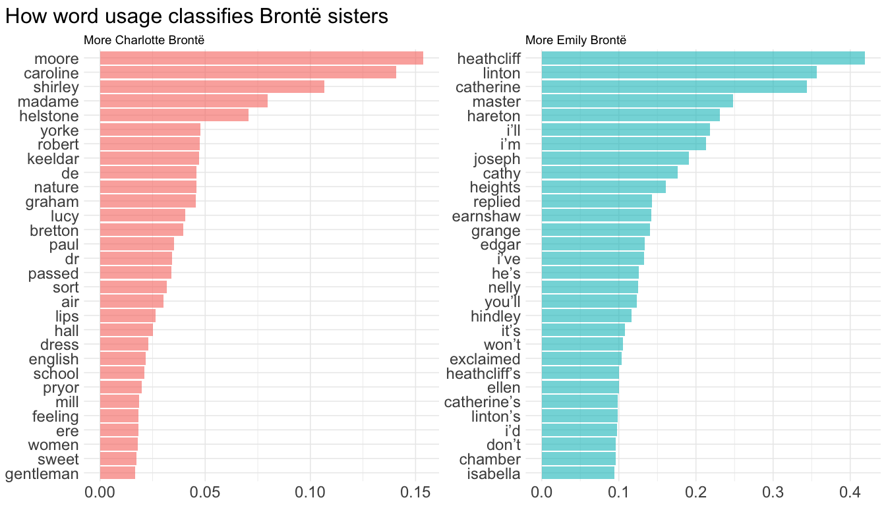

This article demonstrates a modeling example using the
[`tidymodels`](https://www.tidymodels.org/) framework for text
classification. Data are downloaded via the
[`gutenbergr`](https://docs.ropensci.org/gutenbergr/) package, including
5 books written by either Emily Brontë or Charlotte Brontë. The goal is
to predict the author given words in a line, that is the probability of
line being written by one sister instead of another.

``` r
library(dplyr)

# !collapse(1:8)
#> 
#> Attaching package: 'dplyr'
#> The following objects are masked from 'package:stats':
#> 
#>     filter, lag
#> The following objects are masked from 'package:base':
#> 
#>     intersect, setdiff, setequal, union
library(ggplot2)
library(tidyr)
library(stringr)
library(tidytext)
library(gutenbergr)
```

The cleaned `books` dataset contains lines as individual rows.

``` r
mirror_url <- "http://mirrors.xmission.com/gutenberg/"

books <- gutenberg_works(author %in% c("Brontë, Emily", "Brontë, Charlotte")) %>%
    gutenberg_download(meta_fields = c("title", "author"), mirror = mirror_url) %>%
    transmute(title,
        author = if_else(author == "Brontë, Emily",
            "Emily Brontë",
            "Charlotte Brontë"
        ) %>% factor(),
        line_index = row_number(),
        text
    )
books
# !collapse(1:14) collapsed
#> # A tibble: 59,283 × 4
#>    title             author       line_index text               
#>    <chr>             <fct>             <int> <chr>              
#>  1 Wuthering Heights Emily Brontë          1 "Wuthering Heights"
#>  2 Wuthering Heights Emily Brontë          2 ""                 
#>  3 Wuthering Heights Emily Brontë          3 "by Emily Brontë"  
#>  4 Wuthering Heights Emily Brontë          4 ""                 
#>  5 Wuthering Heights Emily Brontë          5 ""                 
#>  6 Wuthering Heights Emily Brontë          6 ""                 
#>  7 Wuthering Heights Emily Brontë          7 ""                 
#>  8 Wuthering Heights Emily Brontë          8 "CHAPTER I"        
#>  9 Wuthering Heights Emily Brontë          9 ""                 
#> 10 Wuthering Heights Emily Brontë         10 ""                 
#> # ℹ 59,273 more rows
```

To obtain tidy text structure illustrated in [Text Mining with
R](https://www.tidytextmining.com/), I use `unnest_tokens()` to perform
tokenization and remove all the stop words. I also removed characters
like `'`, `'s`, `'` and whitespace to return valid column names after
widening. But it turns out this served as some sort of stemming too!
(heathcliff’s becomes heathcliff). Then low frequency words (whose
frequency is less than 0.05% of an author’s total word counts) are
removed. The cutoff may be a little too high if you plot that histogram,
but I really need this to save computation efforts on my laptop
:sweat_smile:.

``` r
clean_books <- books %>%
    unnest_tokens(word, text) %>%
    anti_join(stop_words) %>%
    filter(!str_detect(word, "^\\d+$")) %>%
    mutate(word = str_remove_all(word, "_|'s|'|\\s"))
#> Joining with `by = join_by(word)`

total_words <- clean_books %>%
    count(author, name = "total")

tidy_books <- clean_books %>%
    left_join(total_words) %>%
    group_by(author, total, word) %>%
    filter((n() / total) > 0.0005) %>%
    ungroup()
#> Joining with `by = join_by(author)`
```

## Comparing word frequency

Before building an actual predictive model, let’s do some EDA to see
different tendency to use a particular word! This will also shed light
on what we would expect from the text classification. Now, we will
compare word frequency (proportion) between the two sisters.

``` r
tidy_books %>%
    group_by(author, total) %>%
    count(word) %>%
    mutate(prop = n / total) %>%
    ungroup() %>%
    select(-total, -n) %>%
    pivot_wider(
        names_from = author, values_from = prop,
        values_fill = list(prop = 0)
    ) %>%
    ggplot(aes(
        x = `Charlotte Brontë`, y = `Emily Brontë`,
        color = abs(`Emily Brontë` - `Charlotte Brontë`)
    )) +
    geom_jitter(width = 0.001, height = 0.001, alpha = 0.2, size = 2.5) +
    geom_abline(color = "gray40", lty = 2) +
    geom_text(aes(label = word), check_overlap = TRUE, vjust = 1.5, size = 7.5) +
    scale_color_gradient(low = "darkslategray4", high = "gray75") +
    scale_x_continuous(labels = scales::label_percent()) +
    scale_y_continuous(labels = scales::label_percent()) +
    theme(legend.position = "none") +
    coord_cartesian(xlim = c(0, NA)) +
    theme(
        text = element_text(size = 18),
        plot.title.position = "plot"
    )
```


Words that fall on or near the dotted line (such as “home”, “head”, and
“half”) are used with similar frequency by both sisters. In contrast,
words positioned far from the line indicate a preference by one author
over the other. For instance, “heathcliff”, “linton”, and “catherine”
appear more frequently in one sister’s works compared to the other’s.

What does this plot tell us? Judged only by word frequency, it looks
that there are a number of words that are quite characteristic of Emily
Brontë (upper left corner). Charlotte, on the other hand, has few
representative words (bottom right corner). We will investigate this
further in the model.

## Modeling

### Data preprocessing

There are 430 and features (words) and 32029 observations in total.
Approximately 18% of the response are 1 (Emily Brontë).

``` r
tidy_books %>%
    count(author) %>%
    mutate(prop = n / sum(n))
#> # A tibble: 2 × 3
#>   author               n  prop
#>   <fct>            <int> <dbl>
#> 1 Charlotte Brontë 40191 0.724
#> 2 Emily Brontë     15310 0.276
```

Now it’s time to widen our data to reach an appropriate model structure,
this similar to a document-term matrix, with rows being a line and
column word count.

``` r
library(tidymodels)

# !collapse(1:15) collapsed
#> ── Attaching packages ────────────────────────────────────── tidymodels 1.1.0 ──
#> ✔ broom        1.0.5     ✔ rsample      1.2.1
#> ✔ dials        1.2.0     ✔ tibble       3.2.1
#> ✔ infer        1.0.4     ✔ tune         1.2.1
#> ✔ modeldata    1.2.0     ✔ workflows    1.1.4
#> ✔ parsnip      1.2.1     ✔ workflowsets 1.0.1
#> ✔ purrr        1.0.1     ✔ yardstick    1.3.1
#> ✔ recipes      1.0.7
#> ── Conflicts ───────────────────────────────────────── tidymodels_conflicts() ──
#> ✖ purrr::discard() masks scales::discard()
#> ✖ dplyr::filter()  masks stats::filter()
#> ✖ recipes::fixed() masks stringr::fixed()
#> ✖ dplyr::lag()     masks stats::lag()
#> ✖ recipes::step()  masks stats::step()
#> • Learn how to get started at https://www.tidymodels.org/start/
set.seed(2020)
doParallel::registerDoParallel()

model_df <- tidy_books %>%
    count(line_index, word) %>%
    pivot_wider(
        names_from = word, values_from = n,
        values_fill = list(n = 0)
    ) %>%
    left_join(books, by = c("line_index" = "line_index")) %>%
    select(-title, -text)

model_df
# !collapse(1:20) collapsed
#> # A tibble: 32,029 × 432
#>    line_index heights wuthering chapter returned visit heathcliff black  eyes
#>         <int>   <int>     <int>   <int>    <int> <int>      <int> <int> <int>
#>  1          1       1         1       0        0     0          0     0     0
#>  2          8       0         0       1        0     0          0     0     0
#>  3         11       0         0       0        1     1          0     0     0
#>  4         15       0         0       0        0     0          1     0     0
#>  5         17       0         0       0        0     0          0     1     1
#>  6         19       0         0       0        0     0          0     0     0
#>  7         22       0         0       0        0     0          1     0     0
#>  8         24       0         0       0        0     0          0     0     0
#>  9         26       0         0       0        0     0          0     0     0
#> 10         27       0         0       0        0     0          0     0     0
#> # ℹ 32,019 more rows
#> # ℹ 423 more variables: heart <int>, fingers <int>, answer <int>, sir <int>,
#> #   hope <int>, grange <int>, heard <int>, thrushcross <int>,
#> #   interrupted <int>, walk <int>, closed <int>, uttered <int>, gate <int>,
#> #   words <int>, hand <int>, entered <int>, joseph <int>, bring <int>,
#> #   horse <int>, suppose <int>, nay <int>, dinner <int>, `heathcliff’s` <int>,
#> #   times <int>, guess <int>, wind <int>, house <int>, set <int>, …
```

### Train a penalized logistic regression model

Split the data into training set and testing set.

``` r
book_split <- initial_split(model_df)
book_train <- training(book_split)
book_test <- testing(book_split)
```

Specify a L1 penalized logistic model, center and scale all predictors
and combine them in to a `workflow` object.

``` r
logistic_spec <- logistic_reg(penalty = 0.05, mixture = 1) %>%
    set_engine("glmnet")

book_rec <- recipe(author ~ ., data = book_train) %>%
    update_role(line_index, new_role = "ID") %>%
    step_zv(all_predictors()) %>%
    step_normalize(all_predictors())

book_wf <- workflow() %>%
    add_model(logistic_spec) %>%
    add_recipe(book_rec)

initial_fit <- book_wf %>%
    fit(data = book_train)
```

`initial_fit` is a simple fitted regression model without any
hyper-parameters. By default `glmnet` calls for 100 values of lambda
even if I specify lambda = 0.05. So the extracted result aren’t that
helpful.

``` r
initial_fit %>%
    extract_fit_parsnip() %>%
    tidy()
# !collapse(1:20) collapsed
#> 
#> Attaching package: 'Matrix'
#> The following objects are masked from 'package:tidyr':
#> 
#>     expand, pack, unpack
#> Loaded glmnet 4.1-7
#> # A tibble: 431 × 3
#>    term        estimate penalty
#>    <chr>          <dbl>   <dbl>
#>  1 (Intercept)   -1.14     0.05
#>  2 heights        0        0.05
#>  3 wuthering      0        0.05
#>  4 chapter        0        0.05
#>  5 returned       0        0.05
#>  6 visit          0        0.05
#>  7 heathcliff     0.153    0.05
#>  8 black          0        0.05
#>  9 eyes           0        0.05
#> 10 heart          0        0.05
#> # ℹ 421 more rows
```

We can make predictions with `initial_fit` anyway, and examine metrics
like overall accuracy.

``` r
initial_predict <- predict(initial_fit, book_test) %>%
    bind_cols(predict(initial_fit, book_test, type = "prob")) %>%
    bind_cols(book_test %>% select(author, line_index))

initial_predict
# !collapse(1:15) collapsed
#> # A tibble: 8,008 × 5
#>    .pred_class     .pred_Charlotte Bron…¹ `.pred_Emily Brontë` author line_index
#>    <fct>                            <dbl>                <dbl> <fct>       <int>
#>  1 Charlotte Bron…                  0.766                0.234 Emily…         11
#>  2 Charlotte Bron…                  0.766                0.234 Emily…         26
#>  3 Charlotte Bron…                  0.766                0.234 Emily…         29
#>  4 Charlotte Bron…                  0.766                0.234 Emily…         36
#>  5 Charlotte Bron…                  0.766                0.234 Emily…         49
#>  6 Charlotte Bron…                  0.766                0.234 Emily…         74
#>  7 Charlotte Bron…                  0.766                0.234 Emily…         78
#>  8 Charlotte Bron…                  0.766                0.234 Emily…         79
#>  9 Charlotte Bron…                  0.766                0.234 Emily…         88
#> 10 Charlotte Bron…                  0.766                0.234 Emily…        110
#> # ℹ 7,998 more rows
#> # ℹ abbreviated name: ¹​`.pred_Charlotte Brontë`
```

How good is our initial model?

``` r
initial_predict %>%
    accuracy(truth = author, estimate = .pred_class)
#> # A tibble: 1 × 3
#>   .metric  .estimator .estimate
#>   <chr>    <chr>          <dbl>
#> 1 accuracy binary         0.771
```

Nearly 84% of all predictions are right. This isn’t a very satisfactory
result since “Charlotte Brontë” accounts for 81% of `author`, making our
model only slightly better than a classifier that would assign all
`author` with “Charlotte Brontë” anyway.

### Tuning lambda

We can figure out an appropriate penalty using resampling and tune the
model.

``` r
logistic_wf_tune <- book_wf %>%
    update_model(logistic_spec %>% set_args(penalty = tune()))

lambda_grid <- grid_regular(penalty(), levels = 100)
book_folds <- vfold_cv(book_train, v = 10)
```

Here we build a set of 10 cross validations resamples, and set
`levels = 100` to try 100 choices of lambda ranging from 0 to 1. The
lambda grid can be then tuned with the resamples.

``` r
logistic_results <- logistic_wf_tune %>%
    tune_grid(resamples = book_folds, grid = lambda_grid)
```

We can plot the model metrics across different choices of lambda.

``` r
logistic_results %>%
    collect_metrics() %>%
    mutate(
        lower_bound = mean - std_err,
        upper_bound = mean + std_err
    ) %>%
    ggplot(aes(penalty, mean)) +
    geom_line(aes(color = .metric), size = 1.5, show.legend = FALSE) +
    geom_errorbar(aes(ymin = lower_bound, ymax = upper_bound)) +
    facet_wrap(~.metric, nrow = 2, scales = "free") +
    labs(y = NULL, x = expression(lambda))
#> Warning: Using `size` aesthetic for lines was deprecated in ggplot2 3.4.0.
#> ℹ Please use `linewidth` instead.
```


Ok, the two metrics both display a monotone decrease as lambda
increases, but does not exhibit much change once lambda is greater than
0.1, which is essentially random guess according to the author’s
respective proportion of appearance in the data. This plot shows that
the model is generally better at small penalty, suggesting that the
majority of the predictors are fairly important to the model. We may
lean towards larger penalty with slightly worse performance, because
they lead to simpler models. It follows that we may want to choose
lambda in top rows in the following data frame.

``` r
top_models <- logistic_results %>%
    show_best(metric = "roc_auc", n = 100) %>%
    arrange(desc(penalty)) %>%
    filter(mean > 0.9)

top_models
# !collapse(1:14) collapsed
#> # A tibble: 79 × 7
#>     penalty .metric .estimator  mean     n std_err .config               
#>       <dbl> <chr>   <chr>      <dbl> <int>   <dbl> <chr>                 
#>  1 0.00756  roc_auc binary     0.916    10 0.00147 Preprocessor1_Model079
#>  2 0.00599  roc_auc binary     0.921    10 0.00122 Preprocessor1_Model078
#>  3 0.00475  roc_auc binary     0.923    10 0.00120 Preprocessor1_Model077
#>  4 0.00376  roc_auc binary     0.925    10 0.00122 Preprocessor1_Model076
#>  5 0.00298  roc_auc binary     0.926    10 0.00117 Preprocessor1_Model075
#>  6 0.00236  roc_auc binary     0.926    10 0.00133 Preprocessor1_Model074
#>  7 0.00187  roc_auc binary     0.927    10 0.00130 Preprocessor1_Model073
#>  8 0.00148  roc_auc binary     0.927    10 0.00126 Preprocessor1_Model072
#>  9 0.00118  roc_auc binary     0.927    10 0.00118 Preprocessor1_Model071
#> 10 0.000933 roc_auc binary     0.927    10 0.00119 Preprocessor1_Model070
#> # ℹ 69 more rows
```

`select_best()` with return the 9th row with lambda = 0.000586 for its
highest performance on `roc_auc`. But I’ll stick to the parsimonious
principle and pick $\lambda \approx 0.00376$ at the cost of a fall in
`roc_auc` by 0.005 and in `accuracy` by 0.001.

``` r
logistic_results %>%
    select_best(metric = "roc_auc")
#> # A tibble: 1 × 2
#>    penalty .config               
#>      <dbl> <chr>                 
#> 1 0.000739 Preprocessor1_Model069

book_wf_final <- finalize_workflow(logistic_wf_tune,
    parameters = top_models %>% slice(1)
)
```

Now the model specification in the workflow is filled with the picked
lambda:

``` r
book_wf_final %>% extract_spec_parsnip()
# !collapse(1:7)
#> Logistic Regression Model Specification (classification)
#> 
#> Main Arguments:
#>   penalty = 0.00756463327554629
#>   mixture = 1
#> 
#> Computational engine: glmnet
```

The next thing is to fit the best model with the training set, and
evaluate against the test set.

``` r
logistic_final <- last_fit(book_wf_final, split = book_split)

logistic_final %>%
    collect_metrics()
# !collapse(1:6)
#> # A tibble: 3 × 4
#>   .metric     .estimator .estimate .config             
#>   <chr>       <chr>          <dbl> <chr>               
#> 1 accuracy    binary        0.899  Preprocessor1_Model1
#> 2 roc_auc     binary        0.915  Preprocessor1_Model1
#> 3 brier_class binary        0.0895 Preprocessor1_Model1
```

``` r
logistic_final %>%
    collect_predictions() %>%
    roc_curve(truth = author, `.pred_Emily Brontë`) %>%
    autoplot()
```


The accuracy of our logistic model rises by a rough 9% to 93.8%, with
`roc_auc` being nearly 0.904. This is pretty good!

There is also the confusion matrix to check. The model did well in
identifying Charlotte Brontë (low false positive rate, high
sensitivity), yet suffers relatively high false negative rate
(mistakenly identify 39% of Emily Brontë as Charlotte Brontë, aka low
specificity). In part, this is due to class imbalance (four out of five
books were written by Charlotte).

``` r
logistic_final %>%
    collect_predictions() %>%
    conf_mat(truth = author, estimate = .pred_class)
#>                   Truth
#> Prediction         Charlotte Brontë Emily Brontë
#>   Charlotte Brontë             6054          808
#>   Emily Brontë                    2         1144
```

To examine the effect of predictors, We again use `fit` and
`pull_workflow` to extract model fit. Variable importance plots
implemented in the [vip](https://koalaverse.github.io/vip/index.html)
package provides an intuitive way to visualize importance of predictors
in this scenario, using the absolute value of the t-statistic as a
measure of VI.

``` r
library(vip)
#> 
#> Attaching package: 'vip'
#> The following object is masked from 'package:utils':
#> 
#>     vi

logistic_vi <- book_wf_final %>%
    fit(book_train) %>%
    extract_fit_parsnip() %>%
    vi(lambda = top_models[1, ]$penalty) %>%
    group_by(Sign) %>%
    slice_max(order_by = abs(Importance), n = 30) %>%
    ungroup() %>%
    mutate(Sign = if_else(Sign == "POS",
        "More Emily Brontë",
        "More Charlotte Brontë"
    ))

logistic_vi %>%
    ggplot(aes(
        y = reorder_within(Variable, abs(Importance), Sign),
        x = Importance
    )) +
    geom_col(aes(fill = Sign),
        show.legend = FALSE, alpha = 0.6
    ) +
    scale_y_reordered() +
    facet_wrap(~Sign, nrow = 1, scales = "free") +
    labs(
        title = "How word usage classifies Brontë sisters",
        x = NULL,
        y = NULL
    ) +
    theme(
        axis.text = element_text(size = 18),
        plot.title = element_text(size = 24),
        plot.title.position = "plot"
    )
```



Is it cheating to use names of a character to classify authors? Perhaps
I should consider include more books and remove names for text
classification next time.

Note that variable importance in the left panel is generally smaller
than the right, this corresponds to what we find in the word frequency
plot that Emily Brontë has more and stronger characteristic words.
