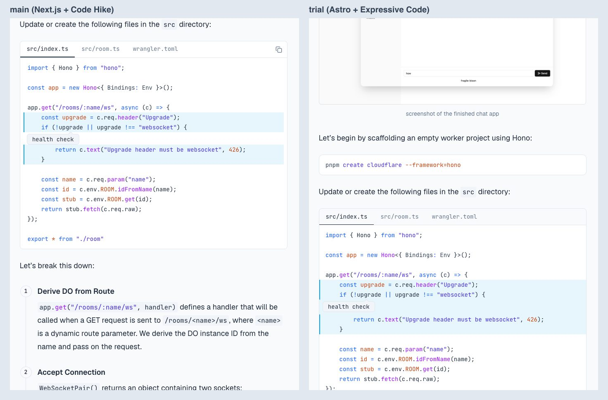

# Proposal: move qiushiyan.dev from Next.js to Astro

Branch `trial/astro`, 2026-10-09. This proposal comes from a working trial, not from reading docs. Everything measured below was measured on this machine against `main` at `211d074`.

**Status:** accepted. The whole site is migrated on this branch (commit "Migrate the whole site to Astro"). See [Answers to the open questions](#answers-to-the-open-questions) to the open questions, and [Before merge](#before-merge) for what's left.

## Verdict: go

Move the site to **Astro 7 as a fully static build**, with a plain Worker in front of Workers Static Assets for the view-count API. Render code with **Expressive Code**, plus a site plugin that reads Code Hike's comment syntax. Keep the content as it is: plain Markdown through Astro's remark/rehype processor, with no codemod.

The trial supports the premise, with two corrections:

- **The Cloudflare adapter makes Astro's dev server heavier than Next's.** `@astrojs/cloudflare` runs `astro dev` inside workerd. In a run alongside `main`, cold start to the first page took 6.8 s (`main`: 4.1 s), with a 3.9 GB peak. Without the adapter, Astro is the lighter server, and the site needs nothing from the adapter: it has one dynamic route.
- **Astro is not faster at every dev task.**
  - A content edit takes ~0.75 s, mostly a fixed 500 ms debounce on Astro's content-store writes. Next takes ~0.27 s on an average post and up to ~0.75 s on the longest one.
  - Cold start is about even.
  - Everything else is faster or lighter:
    - warm restarts take 2.0 s against 3.5 s;
    - a page's first compile takes ~80 ms against ~400–600 ms;
    - memory is roughly half.

What the move buys:
- **JavaScript:** about 99% less on a typical page.
- **HTML:** half the size on code-heavy pages.
- **Deploy build:** about 4× faster.
- **Dev server:** about half the memory.
- **Fewer moving parts:** no OpenNext, Velite, htmr, base64 attribute encoding, or the two pnpm patches.
- **Request path:** page requests no longer invoke a Worker at all.

### Measured comparison

| Measure | `main` (Next 16.3, OpenNext) | Trial (Astro 7.3, static) |
|---|---|---|
| JS on load, home / `/posts` (gzip) | 235 KB, 16 files | **1.1 KB**, 1 file |
| JS on load, post page (gzip) | 243 KB, 17 files | **2.2 KB**, 2 files |
| JS on the counter-demo post, after scrolling to the demo | 243 KB | 72 KB (React island, that page only) |
| *Migrated site:* index pages / post or note (gzip) | 234–243 KB | **2.2 KB / 3.4 KB** (adds the search button and the counter as a custom element) |
| *Migrated site:* recipe page (gzip) | 402 KB | **240 KB** (the editor island) |
| *Migrated site:* react-query note HTML (gzip) | 66 KB | **34 KB** |
| *Migrated site:* `astro build`, all 20 pages + OG cards + Pagefind | — | 6.2 s cold, 2.9 s warm |
| HTML, code-heavy post (gzip) | 35–37 KB (page + RSC payload) | **17–18 KB** |
| Deploy build, cold (what Workers Builds runs) | 13.8 s (`opennextjs-cloudflare build`) | **~3.0 s** (`astro build`, all post and note content rendered) |
| `next build` / `astro build`, cold | 7.2 s | 2.6 s (posts only), 3.0 s (+ notes content) |
| Same, warm cache | 4.3 s | 1.6 s |
| Dev server: start → first page, cold caches | 3.4 s | 3.0 s |
| Dev server: start → first page, warm caches | 3.5 s | **2.0 s** |
| Dev server: first request for a post | 390–625 ms | **77–94 ms** |
| Dev server: repeat request for a post | 40–54 ms | 4–5 ms |
| Dev server: content edit → updated HTML | **256–288 ms** | 741–761 ms |
| Dev server: component edit → updated HTML | 105–124 ms | **71 ms** |
| Dev server: memory (RSS of its process tree) | 2.1–2.3 GB | **1.0–1.4 GB** |

How these were measured:
- **Dev server:** a script started each server, polled `/` and two posts, then appended a marker paragraph to `durable-object-chat/index.md` and polled until the HTML had it. It did the same for a marker in the post template, three times each, then read RSS. Cold runs cleared `.next` and `.velite`, or `.astro` and the Vite caches. Each figure is the median of 3 runs per side, interleaved.
- **JS:** every same-origin `.js` a page loaded by 3 s after `load`, re-compressed with `gzip -6` so both sides are sized the same way. Third-party scripts (the Cloudflare beacon, Giscus) are excluded. "Inline" means scripts embedded in the HTML; on `main` that is mostly the RSC payload.
- **Production:** both sides ran their real production builds, `main` through `opennextjs-cloudflare preview` and the trial through `wrangler dev`.
- **The adapter:** with `@astrojs/cloudflare`, the trial's dev server measured 6.8 s cold to first page, 2.6 s warm, 2.2–3.9 GB, and component edits of ~210 ms. That was an earlier interleaved run, in which `main` measured 4.1 s and 3.9 s.

The trial covers posts, home and `/posts`; `main` builds 40 routes, including 15 OG images. To make the build comparison fair, the 3.0 s row adds a notes collection, so the build renders every post and note through the full pipeline (no note pages). OG images, recipe and note pages will add to it; page rendering is ~10–20 ms per page here.

#### Code-block fidelity

Five blocks covering every annotation the content uses, in light and dark, at 1280 px and 390 px. Each image shows `main` on the left and the trial on the right: [`docs/astro-trial/`](astro-trial/).

| Block | What it exercises | Result |
|---|---|---|
| `b1` durable-object-chat, `server.js` | `#\| filename`, `!mark`, `!collapse … collapsed` | Same. The collapse looks different (see below). |
| `b2` durable-object-chat, code switcher | tabs, `!mark`, `!callout` | Same, including the callout's position and font. |
| `b3` text-classification, R output | `!collapse` open and closed | Same content. The collapse looks different. Shiki's R grammar also colours function calls that Code Hike's highlighter left plain. |
| `b4` python310-pattern-matching | `!callout … :right` | Same. |
| `b5` intro-durable-object | `#\| caption` | Same. |

| Block | Desktop light | Desktop dark | Phone light | Phone dark |
|---|---|---|---|---|
| `b1` | [view](astro-trial/b1-light-1280.jpg) | [view](astro-trial/b1-dark-1280.jpg) | [view](astro-trial/b1-light-390.jpg) | [view](astro-trial/b1-dark-390.jpg) |
| `b2` | [view](astro-trial/b2-light-1280.jpg) | [view](astro-trial/b2-dark-1280.jpg) | [view](astro-trial/b2-light-390.jpg) | [view](astro-trial/b2-dark-390.jpg) |
| `b3` | [view](astro-trial/b3-light-1280.jpg) | [view](astro-trial/b3-dark-1280.jpg) | [view](astro-trial/b3-light-390.jpg) | [view](astro-trial/b3-dark-390.jpg) |
| `b4` | [view](astro-trial/b4-light-1280.jpg) | [view](astro-trial/b4-dark-1280.jpg) | [view](astro-trial/b4-light-390.jpg) | [view](astro-trial/b4-dark-390.jpg) |
| `b5` | [view](astro-trial/b5-light-1280.jpg) | [view](astro-trial/b5-dark-1280.jpg) | [view](astro-trial/b5-light-390.jpg) | [view](astro-trial/b5-dark-390.jpg) |

Visible differences, all small:
- **Collapse.** Code Hike makes the range's first line the toggle, with a chevron gutter and "… 7 lines". Expressive Code keeps that first line as code and adds a summary row, "7 collapsed lines", which stays visible when open so the section can be re-collapsed.
- **Copy button.** It appears on hover on desktop and is always shown on touch devices; `main` always shows it. As a side effect, it no longer overlaps the third tab label at 390 px.
- **Grammars.** Expressive Code uses Shiki's grammars, so a few tokens colour differently (R function calls, `create` in a shell line). The theme and palette are the same: the trial's two themes are built from the existing `tailwind-code-theme.ts` palette.

## What the trial built

On `trial/astro` (`git log main..trial/astro`):

- **Content:** the posts collection, loaded from `content/posts/*/index.md` as they are.
  - Slugs, `lastModified` dates (from git) and the drafts rule match `main`'s Velite output exactly.
  - Reading times use Velite's formula and match on every post but `dynamic-rmd-quarto`, which reads 4 minutes instead of 3.
- **Pages:** the home page, `/posts` with `?tag=` filtering, and post pages with the TOC rail and popover, related posts, pager, Giscus and JSON-LD.
- **Code-heavy posts:** all eight posts render, including durable-object-chat (marks, callouts, code switcher), text-classification (collapsed R output) and python310-pattern-matching (`:right` callouts).
  - The notes were also rendered through the pipeline for measurement: all 31 callouts, 92 marked lines and 64 collapsed ranges convert.
- **Islands:** the live Durable Object counter runs as a React island inside a Markdown post.
- **View counts:** they work against local D1 through `wrangler dev`, including the rate-limit binding (a second POST within a minute doesn't count) and the same-origin check.
- **Hosting:**
  - `pnpm preview` (`astro build && wrangler dev`) serves the production build.
  - Public URLs are unchanged: no trailing slash, and `/posts/x.html` redirects to `/posts/x`.
  - Drafts 404.
- **Checks:** `astro check` and the Worker's `tsc` pass.
- **Not in the trial:** notes, recipes and about pages; search; the feed, sitemap and robots; OG images; analytics; a 404 page.

The pieces:
- `src/lib/content/code-annotations.ts`: the Expressive Code plugin for `!mark`, `!collapse` and `!callout` (~170 lines).
- `src/lib/content/markdown.ts`: rehype and remark plugins for `#|` meta lines, the code switcher, the custom elements, raw `` and inline code.
- `src/lib/content/code-themes.ts`: the light and dark code themes.
- `worker/index.ts`: the view-count Worker.
- `src/components/*.astro`: pages and components, with small inline scripts for the interactive parts.

## Decisions, and what the trial showed

### Code rendering: Expressive Code plus one site plugin

Options considered:
- **Keep Code Hike:** React rendered at build time inside a rehype plugin. It would work under Astro's `unified()` processor, but the site would keep owning every renderer: copy button, tabs, collapse markup, themes. It would also keep a WASM highlighter and a React build dependency that nothing else in the Astro ecosystem uses.
- **Expressive Code:** provides frames, marks, collapsible sections, copy and dual themes out of the box. Its plugin API is enough to read Code Hike's comments directly.
- **Shiki transformers or rehype-pretty-code:**
  - Shiki's notation transformers only mark N lines below a comment, so there are no ranges, collapse or callouts.
  - rehype-pretty-code drives everything from fence meta, and it would still need its own copy button, collapse and tabs.

**Choice: Expressive Code.** The site plugin reads the comments, removes them, and turns them into Expressive Code annotations:
- `!mark(a:b)` becomes text-marker line marks.
- `!collapse(a:b)` becomes collapsible sections. Line `a` stays visible, as in Code Hike; `collapsed` starts the section closed, and without it the section starts open, which Expressive Code can't do on its own.
- `!callout[/re/] text` becomes a bubble under the line, with its arrow at the match, placed with Code Hike's formula. `:right` puts it after the line.

The authoring syntax doesn't change, so no codemod is needed.

### Content format: plain Markdown, unified processor

- **MDX is out.** Quarto's output has `{#id}` headings, bare `<` and `{` in prose, HTML comments and void tags, all of which break MDX. MDX also doesn't map literal lowercase tags such as `<my-callout>` to components.
- **Markdoc** would need a different authoring syntax.
- **Plain `.md` with rehype handles everything:** `<my-callout>` becomes an `<aside>`, `<my-steps>` a CSS counter list, `<code-switcher>` tabs, and `<iframe>` a figure.
- **Astro 7 changed the default:** Markdown now goes through Sätteri, a Rust processor with its own plugin API. remark/rehype plugins need `@astrojs/markdown-remark` and `markdown.processor: unified({...})`.
  - The trial uses `unified()`, which is supported and lets the existing plugin code carry over.
  - Under `unified()`, Astro parses raw HTML only after user plugins have run, so `rehype-raw` has to come first in the list.
  - Moving to Sätteri later means porting ~5 small hast plugins. Expressive Code already supports Sätteri. The trial didn't measure Sätteri, but content edits are floored by Astro's debounce and builds take ~3 s, so there is little left for it to speed up.

### Hosting: static output, no Astro adapter

- **The adapter works, but costs more than it gives here.**
  - It runs dev in workerd. In a run alongside `main`, that meant 6.8 s cold to first page (`main`: 4.1 s) and 2.2–3.9 GB. Without the adapter, the final run measured 3.0 s and 1.0–1.4 GB.
  - It ships a ~770 KB Astro server runtime in the Worker.
  - One trap: the first version of the endpoint read the content collection to validate slugs, which bundled every post's HTML into the Worker (a 1.15 MB chunk).
- **Without the adapter:**
  - `astro build` writes `dist/`.
  - `wrangler.jsonc` sets `main: worker/index.ts`, `assets.directory: ./dist` and `run_worker_first: ["/api/*"]`.
  - Pages are served straight from static assets without running the Worker; only `/api/*` runs it.
  - The Worker validates a slug by asking `ASSETS` whether `/posts/<slug>` exists, so drafts stay out of `post_views`, as before.
  - Prerendering runs in Node again, so satori and resvg work for OG images as they do today.
- **The trade-off:** `astro dev` doesn't run the Worker, so the view count slot stays empty in dev. `pnpm preview` runs the real thing against local D1. If that matters, a Vite proxy from `/api` to a `wrangler dev` on another port restores it in dev.
- **Not hand-rolled, and the adapter's best setting is still slower.**
  - Both sides document this setup: Astro's Cloudflare guide says "If you're using Astro as a static site builder, you don't need an adapter". Cloudflare's [Worker script routing](https://developers.cloudflare.com/workers/static-assets/routing/worker-script/) documents a `main` script plus `run_worker_first` for the paths that need code.
  - The adapter option that comes closest is `prerenderEnvironment: 'node'`, which renders prerendered pages in Node during dev too. Benchmarked interleaved with the static setup, it gave:

    | | Static + Worker | Adapter, `prerenderEnvironment: 'node'` |
    |---|---|---|
    | Dev start to first page, cold / warm | 2.1 s / 1.4 s | 3.3 s / 2.6 s |
    | Dev memory | 1.0–1.4 GB | 1.6–2.4 GB |
    | Cold build | 2.6 s | 4.9 s |

    That's because workerd still runs for the endpoint. Combining this option with on-demand routes has also had a run of dev-mode bugs in 2026 ([#16436](https://github.com/withastro/astro/issues/16436), [#16553](https://github.com/withastro/astro/issues/16553), [#17348](https://github.com/withastro/astro/issues/17348)), all fixed now.
  - The view-count handler is the same code either way; the adapter would only save the few lines that dispatch `/api/views/:slug`.
  - Without an adapter, the build itself guarantees that pages are static: an on-demand page can't be added by accident.

### Astro-native features: used or not

| Feature | Use? | Notes |
|---|---|---|
| Content collections (`glob()` loader) | **Use** | Replaces Velite. Slugs come from `generateId`; `lastModified` and reading time come from a remark plugin. |
| `astro:assets` images | **Use** | Markdown images and Quarto's raw `` (turned into Markdown image nodes) become fingerprinted, sized WebP at build: e.g. 178 KB → 22 KB. The Cloudflare `IMAGES` binding is no longer needed. |
| Islands with client directives | **Use, sparingly** | `client:visible` for the counter demo and, later, the recipe editor. A `.md` body can't render components, so the island renders hidden and a short script moves it into its custom element's place (`src/components/content-islands.astro`). Top-level positions only, which is all the content needs. |
| View transitions | **Native CSS, not `<ClientRouter />`** | `@view-transition { navigation: auto }` keeps the list-to-title morph with no JS in Chromium and Safari 18.2+. Firefox navigates without the animation. `<ClientRouter />` would add JS and change script lifecycles for no gain on a site like this. |
| Prefetch | **Use** | `prefetchAll` on hover. |
| Fonts API | **Use** | Geist and JetBrains Mono, self-hosted at build from Google Fonts. |
| `@astrojs/rss` | **Use** | `/feed.xml` keeps the same URL and the same GUIDs (post URLs), so subscribers see no duplicates. |
| `@astrojs/sitemap` | **No: a small endpoint instead** | `@astrojs/sitemap` writes `sitemap-index.xml` and can't see content dates. `src/pages/sitemap.xml.ts` (~50 lines) keeps the URL and the git `lastmod` per article; its URL list matches the live sitemap exactly. |
| Search | **Pagefind** | Today the Fuse index is serialized into every page. Pagefind indexes the article bodies at build. The nav button imports Pagefind's component UI on first click or ⌘K (38 KB of JS and 5.5 KB of CSS, gzipped), so no page pays for search until it's used. Dev search shows the last build's index. |
| OG images | **satori + resvg in a prerendered endpoint** | A direct port of `src/lib/og.tsx`, kerning fix included. `astro-og-canvas` is the alternative, but it's a fixed template. |
| Actions, sessions, live collections, server islands | **No** | Nothing on the site needs them. |
| Cloudflare adapter | **No** | See above. |

### Hypotheses from the previous session

| Hypothesis | Result |
|---|---|
| Expressive Code covers marks, collapse, file frames, copy and light/dark, but not `!callout`. | **Confirmed, then extended.** There is no built-in callout and collapsed sections can't start open, but the site plugin handles both. `!callout` doesn't need to be dropped. Captions are handled by wrapping the block in a `<figure>` before Expressive Code runs. |
| Inline `` _py`code`_ `` needs Shiki directly. | **Confirmed.** A rehype plugin calls Shiki's `codeToHast` with the same two themes, for article bodies, descriptions and TOC titles. |
| Quarto's custom tags map more cleanly through rehype than MDX. | **Confirmed.** Add that under Astro 7, `rehype-raw` has to run first. |
| Code Hike would run in Astro but means carrying a React-only pipeline. | **Plausible, not built.** Expressive Code produced the same output with less code owned by the site, so the trial didn't build it. |
| SvelteKit and SolidStart are out. | **Agreed.** Nothing in the trial argued otherwise. React stays only as islands; the counter could become a ~1 KB custom element, or a Preact island, if 72 KB on that one page matters. |

## Feature mapping

**Keep** = same behaviour, re-implemented. **Replace** = different implementation. **Drop** = gone.

| Current | Decision | Astro side, and the cost to readers |
|---|---|---|
| Next.js App Router + OpenNext + read-only incremental cache | Replace | Static `astro build`. Pages are plain assets and only `/api/*` runs the Worker. |
| Velite | Replace | Content collections. Same frontmatter, slugs, drafts rule, reading-time formula and git `lastModified`. |
| htmr + component registry + base64 attributes + htmr patch | Drop | Content is final HTML at build time. Nothing renders Markdown at runtime. |
| Code Hike highlighting + `@code-hike/lighter` patch | Replace | Expressive Code (Shiki grammars), same palette. |
| `!mark` | Keep | Same look. |
| `!collapse` / `collapsed` | Keep | Native `
`. A separate summary row instead of the chevron on the first line. |
| `!callout`, `:right` | Keep | The site plugin. Same look and placement. |
| `#\| filename`, `#\| caption` | Keep | Frame title; `<figure>` + `<figcaption>`. |
| Copy button | Keep | Expressive Code's, revealed on hover on desktop. |
| `<code-switcher>` | Keep | `<code-tabs>` custom element (~30 lines, ARIA tabs, arrow keys). Without JS the first tab shows. |
| Inline `` _py`code`_ `` | Keep | Shiki, both themes. |
| `<my-callout>`, `<my-steps>`, `<iframe>` | Keep | Build-time HTML and CSS. |
| Markdown images | Keep, improved | Optimised WebP with intrinsic size. |
| DO counter demo | Keep | A `<do-counter-example>` custom element, ~2 KB, instead of a 72 KB React island. Only the posts that use it load it. |
| Quiz table (draft Postgres post) | Replace | It was static data in a React component; it's now a plain HTML `<table>` in the post. |
| Recipe editor (CodeMirror + react-py) | Keep | `client:only` React island on recipe pages only: 240 KB gzipped, against 402 KB on `main`. The site's only React code. |
| Search (Fuse + Radix dialog) | Replace | Pagefind with its component UI. Full-text results; titles-only fuzzy matching changes to word matching. |
| Theme toggle (next-themes) | Keep | A pre-paint inline script and a button, using the same `localStorage` key, so saved choices carry over. |
| `/posts` tag filter | Keep | Custom element over the static list; same `?tag=` URLs. |
| TOC rail, popover, active heading | Keep | Static list, native `[popover]`, and a vanilla port of the scroll logic. |
| View counter | Keep | Custom element plus `worker/index.ts`. Same D1 table, rate limiter and same-origin rule. |
| Giscus | Keep | The `client.js` embed, with theme sync via `postMessage`. Threads are still mapped by `og:title`. |
| Next `<Link>` client-side navigation | Drop | Full page loads with hover prefetch and native view transitions. Readers lose nothing visible except the title morph in Firefox. |
| `next/image` with the Cloudflare `IMAGES` binding | Drop | Build-time optimisation; the binding goes away. |
| `next/og` OG images | Replace | satori + resvg endpoint. The `og:image` URLs change; platforms re-scrape. |
| Sitemap, robots, RSS, JSON-LD | Keep | Same URLs. The feed's GUIDs and links match the live feed. `@astrojs/rss` adds trailing slashes by default, which would have re-sent every post to subscribers, so `trailingSlash: false` is set. |
| `WORKER_SELF_REFERENCE` binding | Drop | OpenNext-only. |
| Cloudflare and Google analytics | Keep | Plain script tags. |

## Migration plan: one PR

Build it on `trial/astro`, which already holds the trial commits.

**Prep: one dashboard change, before the PR.** Workers Builds commands are global to the project, so today the Astro branch's preview builds fail, and switching the commands at merge time is a race.
- Add three scripts to `main`: `cf:build` (`opennextjs-cloudflare build`), `cf:deploy` and `cf:upload`.
- Point the dashboard at `pnpm cf:build`, `pnpm cf:deploy` and `pnpm cf:upload`.
- From then on each branch decides its own commands. The PR's preview build deploys the Astro site to a preview URL, and the cutover is an ordinary merge.

This is the only part that lands separately, for that operational reason.

**The PR:**
1. **Collections:**
   - `notes`: same schema. The note description is derived from H2 topics, as `describeNote` does now.
   - `recipes`: `content/recipes/index.yaml` plus the source files.
   - `about`.
2. **Pages:**
   - `/notes`, `/notes/[slug]` and `/about`.
   - `/recipes` and `/recipes/[group]/[slug]`, with the editor as a React island.
   - `404.astro` (served via `not_found_handling: "404-page"`).
   - Factor the post page's article layout into a shared component for posts and notes.
3. **Feeds and SEO:**
   - `src/pages/feed.xml.ts` with `@astrojs/rss`, keeping the item GUIDs.
   - `@astrojs/sitemap`, plus a `/sitemap.xml` redirect in `public/_redirects`.
   - `robots.txt`.
   - OG images in `src/pages/og/[...slug].png.ts`, ported from `src/lib/og.tsx`.
4. **Search:** Pagefind, run with `astro-pagefind` or as a postbuild step, behind the existing nav button.
5. **Site chrome:** analytics tags; the mobile-nav popover polish.
6. **Content fix:** two annotations in `content/notes/react-query/index.md`, `!mark(1:3) find the issue query for the repo` and `!mark(1:1) return the repo name…`, put text where Code Hike expects a colour. On `main` that makes both CSS colours invalid, so the marks don't show at all. The trial ignores the text and shows ordinary marks. Decide whether they were meant to be callouts.
7. **Tooling:**
   - Replace `eslint.config.mjs` with `eslint-plugin-astro` and typescript-eslint, or drop ESLint for `astro check` plus Prettier; the ESLint 9 pin only existed for `eslint-plugin-react`.
   - Keep `pnpm spellcheck` and the Quarto scripts.
8. **Remove:** Next.js, OpenNext, Velite, htmr, Code Hike, Radix, next-themes, next-view-transitions, `patches/` and the related `pnpm-workspace.yaml` entries. Also `src/app`, `.velite` and `.open-next`.
9. **Content files stay untouched,** apart from item 6, so no post's "Updated" date moves (it comes from the file's last commit).
10. **Verify:**
   - `astro build` succeeds, and `dist/` lists every current URL. Diff it against `main`'s route table.
   - `pnpm preview` passes: view counts, rate limit, drafts 404, `/feed.xml` and `/sitemap.xml`.
   - Screenshots of a note and a recipe page in both themes and at both widths.
   - Lighthouse on a post.
   - Delete `docs/astro-trial/` before merge.
11. **Docs:** rewrite `CLAUDE.md` and the README for the new architecture in your docs pass, once the implementation has settled.

**Dashboard settings at cutover,** if the prep step is skipped:

| Setting | Now | After |
|---|---|---|
| Build command | `opennextjs-cloudflare build` | `pnpm build` (`astro build`) |
| Deploy command (`main`) | `opennextjs-cloudflare deploy` | `npx wrangler deploy` |
| Non-production branch command | `opennextjs-cloudflare upload` | `npx wrangler versions upload` |
| Environment | `GITHUB_TOKEN` optional | Unchanged. `NEXTJS_ENV` is no longer used. |
| Clone depth | Full (for `lastModified`) | Unchanged |

The Worker name (`qiushiyan`), custom domain, D1 database and rate-limit namespace don't change. The `IMAGES` and `WORKER_SELF_REFERENCE` bindings go away. Rollback is a Worker version rollback in the dashboard, or a revert of the merge.

## Risks

- **Astro 7 is new and still moving.**
  - Sätteri became the default and the remark/rehype pipeline became opt-in. If `unified()` is ever deprecated, the five small hast plugins need porting.
  - `@astrojs/cloudflare` 15 (in beta) replaces the Wrangler config with its own `cloudflare.config.ts`, according to its changelog. The static design doesn't use the adapter, which is one reason to prefer it.
- **The annotation plugin leans on Expressive Code internals:**
  - the `.highlight.mark` line classes;
  - `pluginCollapsibleSectionsData`, an exported attached-data handle;
  - the `.ec-section > details` markup.
  
  Pin Expressive Code and re-check the five screenshot blocks on upgrade.
- **Stale styles after Expressive Code config edits (dev only).** Astro's content cache doesn't notice Expressive Code option changes, so cached pages keep linking an old `ec.*.css`, and dev serves that as a 404. Clear `.astro` and `node_modules/.astro` after editing Expressive Code options. A config restart alone doesn't fix it.
- **Content edits cost ~0.75 s in dev,** even on short posts, because of Astro's 500 ms store-write debounce.
- **Islands in Markdown:** a custom element can only mark the position of a top-level island; islands can't nest inside other custom elements.
- **Measurement limits:**
  - One machine (Apple M6, 32 GB) with other sessions running (load average 6–10), so treat differences under ~20% as noise.
  - Medians of 2–3 runs.
  - Build and dev numbers cover posts (plus notes content for the build). Note pages, recipe pages, OG images and Pagefind will add a few seconds to the build.

## Answers to the open questions

Your answers to the open questions, and what the migration did with them:

1. **Dev latency doesn't matter; agent-friendly structure does.** The code is laid out by domain:
   - `src/lib/markdown/`: the content pipeline, one file per concern.
   - `src/lib/content/`: collection queries.
   - `src/layouts/`: the base, page and article layouts.
   - `src/components/<area>/`.
   - `worker/`: the only request-time code.

   Interactive content elements are listed in one registry (`src/lib/markdown/elements.ts`). The pipeline records which ones each entry uses, so there's no hand-maintained `components` frontmatter. The build warns on unknown custom elements.
2. **Full page loads with prefetch and native view transitions:** done.
3. **Full-text search:** Pagefind, loaded on first use.
4. **Collapsed-range look:** kept.
5. **Copy button:** shown on hover (Expressive Code's default).
6. **Counter:** rewritten as a custom element. Verified loading values, incrementing and the rate-limit notice against a stubbed API.
7. **The two react-query marks:** now `!mark` plus `!callout` (`.qmd` and `.md`).
8. **Workers Builds commands:** branch `chore/workers-build-scripts` adds `cf:build`, `cf:deploy` and `cf:upload` to `main` with the OpenNext commands; this branch defines them for Astro.

## Before merge

1. **Repoint the build commands.**
   - Merge `chore/workers-build-scripts` into `main`.
   - Set the Workers Builds dashboard to `pnpm cf:build` (build), `pnpm cf:deploy` (deploy) and `pnpm cf:upload` (non-production branches).
   - From then on, this branch's preview builds deploy the Astro site.
2. **Check the preview deployment:**
   - view counts against the real D1 database;
   - a Giscus thread on a post;
   - the counter demo, which only answers qiushiyan.dev origins;
   - social cards in a link-preview checker.
3. **Docs pass:** `CLAUDE.md` and the README still describe the Next.js architecture.
4. **Delete `docs/astro-trial/`**, and decide whether this proposal stays as a decision record.
5. **After the merge deploys,** remove the `IMAGES` binding from the dashboard if it was set there.
